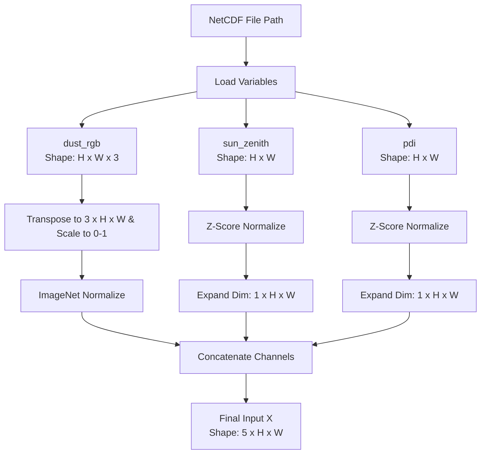

# Training Process

## 1. Data Normalization & Preprocessing

To ensure stable gradients and accelerate convergence during training, all input features are normalized before being combined into a 5-channel tensor. The preprocessing steps and normalization parameters are detailed below.

### Normalization Parameters

| Feature Channel | Source Variable         | Normalization Method   | Mean ($\mu$) | Standard Deviation ($\sigma$) |
| :-------------- | :---------------------- | :--------------------- | :----------- | :---------------------------- |
| **0** (Red)     | `dust_rgb` (R)          | ImageNet Normalization | `0.485`      | `0.229`                       |
| **1** (Green)   | `dust_rgb` (G)          | ImageNet Normalization | `0.456`      | `0.224`                       |
| **2** (Blue)    | `dust_rgb` (B)          | ImageNet Normalization | `0.406`      | `0.225`                       |
| **3**           | `sun_zenith`            | Z-score Normalization  | `89.064937`  | `43.909445`                   |
| **4**           | `pdi` (Pink Dust Index) | Z-score Normalization  | `0.5071591`  | `0.1111518`                   |

###  Mathematical Formulas

#### 1. ImageNet Normalization (Channels 0–2)
For each channel $c \in \{\text{Red, Green, Blue}\}$, the raw pixel values (scaled to $[0, 1]$) are normalized as:
$$x'_c = \frac{x_c - \mu_{ImageNet, c}}{\sigma_{ImageNet, c}}$$

#### 2. Z-Score Normalization (Channels 3 & 4)
For auxiliary channels (`sun_zenith` and `pdi`), Z-score normalization is applied with a small constant $\epsilon = 10^{-8}$ to prevent division by zero:
$$z = \frac{x - \mu}{\sigma + 10^{-8}}$$

### Multi-Channel Assembly Pipeline

1. **Transpose**: The `dust_rgb` array is transposed from spatial-last `(H, W, 3)` to channels-first `(3, H, W)`.
2. **Channel Expansion**: The 2D variables `sun_zenith` and `pdi` are expanded along the channel axis (axis 0) to shapes of `(1, H, W)`.
3. **Concatenation**: All preprocessed channels are concatenated along the channel dimension to form the final input tensor $X \in \mathbb{R}^{5 \times 148 \times 357}$.
4. **NaN Handling**: Any invalid or missing satellite measurements (e.g., cloudy areas or off-disk space) are replaced with zero using `torch.nan_to_num()`.

---

## 2. Dataset Filtering & Splitting

Satellite records contain many clear-sky steps and off-season intervals with no dust plumes. To prioritize meaningful events, the training pipeline performs active filtering:

1. **Seasonal Filtering**: The dataset is restricted to active dust season months: **March, April, May, June, July, and August** (`[3, 4, 5, 6, 7, 8]`).
2. **Activity Filtering**: For each candidate timestep, the total count of ground-truth dust plume pixels (`plume_id > 0`) is calculated. Only timesteps with **$> 100$ active plume pixels** are retained.
3. **Data Splitting**:
   - The filtered active indices are shuffled deterministically using a random state seed of `42`.
   - The data is split into **90% Training** and **10% Validation**.

---

## 3. DataLoader & Data Augmentation

To maximize learning capacity and generalize to variations in dust shape, the training pipeline incorporates multi-threaded data loaders and dynamic spatial augmentations.

### Real-Time Augmentation
During training, the following augmentations are applied on-the-fly to the normalized inputs $X$ and binary labels $Y$:
* **Random Horizontal Flip** (50% probability)
* **Random Vertical Flip** (50% probability)

### DataLoader Optimizations
* **PyTorch DataLoader** is configured with `num_workers=8` (training) and `num_workers=4` (validation).
* **`pin_memory=True`** is enabled to speed up CPU-to-GPU data transfers.
* **`persistent_workers=True`** and **`prefetch_factor=2`** keep the loader workers alive across epochs, preventing worker recreation overhead.
* **Deterministic Seeds**: A custom `worker_init_fn` uses `torch.initial_seed()` to ensure workers generate independent, deterministic random seeds for augmentations.

---

##  4. Model Architecture & Dimension Adaption

The core neural network is a **UNet++** framework designed for high-resolution semantic segmentation.

* **Backbone Encoder**: `efficientnet-b4` initialized with pretrained ImageNet weights.
* **Input Layer**: Configured for `in_channels=5` to ingest the fused satellite tensor.
* **Decoder Attention**: Spatial and Channel Squeeze & Excitation (**SCSE**) blocks are embedded in the decoder to dynamically highlight key channels and spatial regions.
* **Dimension Adaption (Padding & Cropping)**:
  * The EfficientNet-B4 encoder requires inputs to be multiples of $32$ (due to 5 downsampling stages).
  * The raw image shape is `(148, 357)`.
  * **Before Forward Pass**: Input is padded to `(160, 384)` by adding 27 pixels horizontally and 12 pixels vertically (`F.pad(x, (0, 27, 0, 12))`).
  * **After Decoder**: The padded region is cropped out, returning the output logits back to the original size: `out[:, :, :148, :357]`.

---

## 5. Loss Function

Dust plumes are highly localized, covering only a tiny fraction of the satellite disk (often $< 1\%$ of the pixels). Standard binary cross-entropy (BCE) causes the network to converge to predicting clear skies. To prevent this, a custom compound **`FocalDiceBCELoss`** is used.

The loss combines three components:

$$L_{\text{total}} = L_{\text{BCE}} + L_{\text{Focal}} + L_{\text{Dice}}$$

1. **Weighted BCE Loss ($L_{\text{BCE}}$)**:
   $$\text{pos\_weight} = 15.0$$
   Applies a multiplier of 15 to positive classes to penalize missed dust pixels.
2. **Focal Loss ($L_{\text{Focal}}$)**:
   $$L_{\text{Focal}} = -\alpha_t (1 - p_t)^\gamma \log(p_t)$$
   Parameters: $\alpha = 0.90$, $\gamma = 2.0$. It downweights easy-to-classify background pixels and forces the model to focus on hard, ambiguous dust boundaries.
3. **Dice Loss ($L_{\text{Dice}}$)**:
   $$L_{\text{Dice}} = 1 - \frac{2 \sum (p \cdot y) + \epsilon}{\sum p + \sum y + \epsilon}$$
   Directly optimizes the overlap (F1-score) of the predicted segmentations.

---

## 6. Optimization & Performance Tuning

The model is optimized using advanced hardware acceleration and optimization schedules:

* **Optimizer**: **AdamW** with a learning rate of $10^{-4}$ (or $3\cdot10^{-4}$) and a weight decay of $10^{-4}$.
* **LR Scheduler**: **CosineAnnealingWarmRestarts** with period $T_0 = 5$ epochs and minimum learning rate $\eta_{min} = 10^{-6}$.
* **Automatic Mixed Precision (AMP)**: Uses PyTorch `autocast` (`float16`) coupled with `GradScaler` to double execution speed and halve VRAM usage while maintaining numerical stability.
* **TF32 Activation**: TensorFloat-32 execution is enabled (`allow_tf32 = True`) to accelerate matrix multiplication on NVIDIA Ampere/Ada Lovelace architectures.
* **Gradient Clipping**: Gradients are clipped to a maximum norm of `1.0` to prevent exploding gradients during optimization steps.
* **Gradient Accumulation**: Support for custom batch size simulation via `accumulation_steps` (e.g. accumulating gradients over 4 batches before stepping).

---